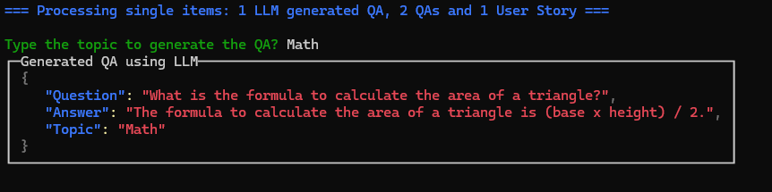
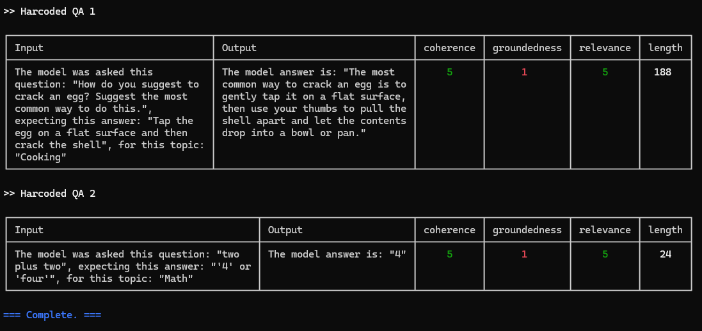

# Evaluating a LLM with .NET

This repo contains a library and samples for evaluating the output of an LLM, similat to what we  uses in a RAG architecture.
There are many parameters that affect the quality and style of answers generated by a chat app,
such as the system prompt, search parameters, and GPT model parameters.

This repository offers tools and samples to make it easier to run evaluations, plus examples of evaluations
that we've run on our [SAMPLE CHAT NET - WIP](https://github.com//).

**WIP** [📺 Watch a video overview of this repo](https://www.youtube.com/watch?v=mM8pZAI2C5w)

Table of contents:

* [Setting up this project](#setting-up-this-project)
* [Deploying a GPT-4 model](#deploying-a-gpt-4-model)
* [Generating ground truth data](#Generate-a-QA-from-a-Topic)
* [Running an evaluation](#running-an-evaluation)
* [Viewing the results](#viewing-the-results)


## Setting up this project

If you open this project in a Dev Container or GitHub Codespaces, it will automatically set up the environment for you.
If not, then follow these steps:

1. Install .NET 8 or higher
2. Install Visual Studio 2022 or Visual Studio Code

## Deploying a GPT-4 model

It's best to use a GPT-4 model for performing the evaluation, even if your chat app uses GPT-3.5 or another model. You can either use an Azure OpenAI instance, an openai.com instance or any LLM supported by Semantic Kernel.

The KernelFactory class [`src\LLMEval.Test\KernelFactory.cs`], creates the necessary kernels for evaluation, generating ground data and the LLM to be tested.

The following code, shows how to create 3 different kernels:
 
```csharp
// ========================================
// create kernels
// ========================================
var kernelEval = KernelFactory.CreateKernelEval();
var kernelTest = KernelFactory.CreateKernelEval();
var kernelGenData = KernelFactory.CreateKernelGenerateData();
```

### Creating Kernels for Azure OpenAI Services or OpenAI APIs

You can use .NET User Secrets to store the necessary information to create the kernels. In example run these commands in bash to store the information related to an Azure OpenAI Service Endpoint:

```bash
dotnet user-secrets init
dotnet user-secrets set "AZURE_OPENAI_MODEL" "Azure OpenAI Deployment Name"
dotnet user-secrets set "AZURE_OPENAI_ENDPOINT" "Azure OpenAI Deployment Endpoint"
dotnet user-secrets set "AZURE_OPENAI_KEY" "Azure OpenAI Deployment Key"
```

Now the KernelFactory class can create a kernel with the following code:

```csharp
public static Kernel CreateKernelEval()
{
    var config = new ConfigurationBuilder().AddUserSecrets<Program>().Build();

    var builder = Kernel.CreateBuilder();

    builder.AddAzureOpenAIChatCompletion(
        config["AZURE_OPENAI_MODEL"],
        config["AZURE_OPENAI_ENDPOINT"],
        config["AZURE_OPENAI_KEY"]);

    return builder.Build();
}
```

To learn more about Project Secrets in Development * [Project Secrets in Development](#https://learn.microsoft.com/en-us/aspnet/core/security/app-secrets?view=aspnetcore-8.0&tabs=windows)

### Creating Kernels to access Open Source LLMs, like Llama 3 or Phi-3

Semantic Kernel also allows the access to any model that supports the [OpenAI Chat Completions API](https://github.com/ollama/ollama/blob/main/docs/openai.md). 

The following example creates a kernel using a Llama 3 model deployed and hosted locally using ollama. 

```csharp
public static Kernel CreateKernelEval()
{
    var config = new ConfigurationBuilder().AddUserSecrets<Program>().Build();

    var builder = Kernel.CreateBuilder();

        builder.AddOpenAIChatCompletion(
            modelId: "llama3",
            endpoint: new Uri("http://localhost:11434"),
            apiKey: "api");

    return builder.Build();
}
```

This blog explains how to host a local LLM using ollama, [Llama 3](https://ollama.com/blog/llama3)


## Generating ground truth data

In order to evaluate new answers, they must be compared to "ground truth" answers: the ideal answer for a particular question. We recommend at least 200 QA pairs if possible.

There are a few ways to get this data:

1. Manually curate a set of questions and answers that you consider to be ideal. This is the most accurate, but also the most time-consuming. Make sure your answers include citations in the expected format. This approach requires domain expertise in the data.
2. Use the generator class to generate a set of questions and answers. This is the fastest, but may also be the least accurate. 
3. Use the generator class to generate a set of questions and answers, and then manually curate them, rewriting any answers that are subpar and adding missing citations. This is a good middle ground, and is what we recommend.

<details>
 <summary>Additional tips for ground truth data generation</summary>

* Generate more QA pairs than you need, then prune them down manually based on quality and overlap. Remove low quality answers, and remove questions that are too similar to other questions.
* Be aware of the knowledge distribution in the document set, so you effectively sample questions across the knowledge space.
* Once your chat application is live, continually sample live user questions (within accordance to your privacy policy) to make sure you're representing the sorts of questions that users are asking.

</details>

## Generate a QA from a Topic

This repo includes a set of libraries to process and generate questions and answers from a specific topic.

The following code is part of the main program, in the console application and show how to generate a QA from a topic. Each QA have a field for the question, the answer and the topic. 

```csharp
// ask for the topic to generate the QAs
var topic = SpectreConsoleOutput.AskForString("Type the topic to generate the QA?");

var qa = await QALLMGenerator.GenerateQA(kernelGenData, topic);
var json = JsonSerializer.Serialize(qa, new JsonSerializerOptions
{
    WriteIndented = true
});
SpectreConsoleOutput.DisplayJson(json, "Generated QA using LLM", true);
```

The demo code also shows the generated QA, in JSON format in the console. The output is similar to this one:




## Generate a collection of QAs

The generator can also generate a collection of QAs. The following code shows how to generate 3 sample QAs and it converts the generated collection to JSON.

```csharp
// generate a collection of QAs using llms
var llmGenQAs = await QALLMGenerator.GenerateQACollection(kernelGenData, 3);

// convert llmGenQAs to json
var json = JsonSerializer.Serialize(llmGenQAs, new JsonSerializerOptions
{
    WriteIndented = true
});
```

This is a sample for the generated json questions:

```json
{
    "Question": "What were the primary causes of World War I?",
    "Answer": "The primary causes of World War I were militarism, alliances, imperialism, and nationalism.",
    "Topic": "History"
},
{
    "Question": "What is the formula to calculate the area of a circle?",
    "Answer": "The formula to calculate the area of a circle is A = \u03C0r^2, where A is the area and r is the radius of the circle.",
    "Topic": "Math"
},
{
    "Question": "Who is the author of the book \u0027To Kill a Mockingbird\u0027?",
    "Answer": "Harper Lee",
    "Topic": "Literature"
}
```

## Running an evaluation

Once a QA or a collection of QAs is available, the EvalLLM library can run the evaluation against the collection. The following image shows the console output of 2 different evaluated QAs.



This the necessary code to run the eval of a QA:
```csharp
var qaProcessor = new QACreator.QACreator(kernelTest);
var qa = new QA
{
    Question = "two plus two",
    Answer = "'4' or 'four'",
    Topic = "Math"
};

var processResult = await qaProcessor.Process(qa);
var results = await batchEval.ProcessSingle(processResult);
results.EvalRunName = "Harcoded QA 1";
SpectreConsoleOutput.DisplayResults(results);
```


### Specifying the evaluate metrics

The LLMEval will use the metrics specified while creating the object. These metrics are custom metrics that we've added based on the python sample: [Evaluating a RAG Chat App
](https://github.com/Azure-Samples/ai-rag-chat-evaluator/tree/main).

The following code shows how to add the 3 main custom evaluators:

- coherence
- groundedness
- relevance

```csharp
// ========================================
// create LLMEval and add evaluators
// ========================================
var kernelEvalFunctions = kernelEval.CreatePluginFromPromptDirectory("Prompts");
var batchEval = new Core.LLMEval();

batchEval
    .AddEvaluator(new PromptScoreEval("coherence", kernelEval, kernelEvalFunctions["coherence"]))
    .AddEvaluator(new PromptScoreEval("groundedness", kernelEval, kernelEvalFunctions["groundedness"]))
    .AddEvaluator(new PromptScoreEval("relevance", kernelEval, kernelEvalFunctions["relevance"]))
    .AddEvaluator(new LenghtEval());
batchEval.SetMeterId("llama3");
```

#### Built-in metrics

On the source material, they use a set of Built-In metrics. These metrics are calculated by sending a call to the GPT model, asking it to provide a 1-5 rating, and storing that rating.

* [`gpt_coherence`](https://learn.microsoft.com/azure/ai-studio/concepts/evaluation-metrics-built-in#ai-assisted-coherence) measures how well the language model can produce output that flows smoothly, reads naturally, and resembles human-like language.
* [`gpt_relevance`](https://learn.microsoft.com/azure/ai-studio/concepts/evaluation-metrics-built-in#ai-assisted-relevance) assesses the ability of answers to capture the key points of the context.
* [`gpt_groundedness`](https://learn.microsoft.com/azure/ai-studio/concepts/evaluation-metrics-built-in#ai-assisted-groundedness) assesses the correspondence between claims in an AI-generated answer and the source context, making sure that these claims are substantiated by the context.

#### Custom metrics

The following metrics are implemented very similar to the built-in metrics, but use a locally stored prompt. They're a great fit as we don't have access to the built-in metrics.

* `coherence`: Measures how well the language model can produce output that flows smoothly, reads naturally, and resembles human-like language. Based on `src/LLMEval.Core/_prompts/coherence/skprompt.txt`.
* `relevance`: Assesses the ability of answers to capture the key points of the context. Based on `src/LLMEval.Core/_prompts/relevance/skprompt.txt`.
* `groundedness`: Assesses the correspondence between claims in an AI-generated answer and the source context, making sure that these claims are substantiated by the context. Based on `src/LLMEval.Core/_prompts/groundedness/skprompt.txt`.

## Viewing the results

The results of each evaluation are stored in a results folder (defaulting to `example_results`).
Inside each run's folder, you'll find:

* `eval_results.jsonl`: Each question and answer, along with the GPT metrics for each QA pair.
* `parameters.json`: The parameters used for the run, like the overrides.
* `summary.json`: The overall results, like the average GPT metrics.
* `config.json`: The original config used for the run. This is useful for reproducing the run.

To make it easier to view and compare results across runs, we've built a few tools,
located inside the `review-tools` folder.

